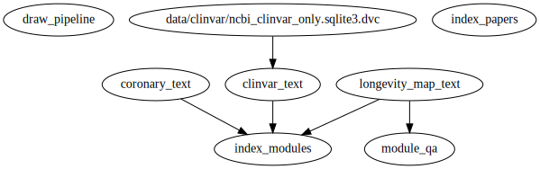

# longevity-genie

The core idea about Longevity genie project is extending abilities of large language models (LLMs) to answer questions about personal health, genetics and longevity research.
Currently, LLMs like ChatGPT (and also numerous LLAMA/ALPACA based opensource models) do not possess domain-specific biological knowledge and often hallucinate (make things up) when you ask it specific question.
There are different ways to improve it:
* extending user prompts with additional instructions on how the model should behave
* using vector similarity search in vector databases that will extend that user prompts with additional results
* using LLM-driven agents that will use search, code writing, SQL and other tools to extract information from external sources when answering user request
* using LLM-driven routing when the query is routed to different subchains and agents depending on its content
* fine-tuning of existing models to work better with new data - such approach will be possible if we will switch from GPT4 to smallerr opensource models that can be fine-tined with QLora and similar techniques.

We are actively applying langchain to build the system. If you have not used it before [this course](https://learn.deeplearning.ai/langchain) is very good to get started.

# DISCLAIMER

The project is in active refactoring, so part of the features is temorally broken.

# setting things up

## Git clone the repository:
```bash
git@github.com:dna-seq/longevity-genie.git
```
Set up the environment. You can use micromamba, conda or anaconda to do this, with exception of executable all commands are the same in all cases.
We are usually using [micromamba](https://mamba.readthedocs.io/en/latest/user_guide/micromamba.html) as it is the fastest
```
micromamba create -f environment.yaml
micromamba activate longevity-genie
```
## Pull data from DVC
We are using [DVC](http://dvc.org) for data version control. 
It is required because database index does not fit into git.
To set it up do:
```bash
dvc pull
```
We use Google Drive to store data, so it may ask you to authorize data access.

# Environment

To run openai API and langchain tracing you need keys in your environment variables. 
Do not forget to put on your openai and langchain trace keys.
In .env.template there are environment variables, fill them in with your keys and rename to .env.


# Preprocessing
Our chains use two indexes one for papers and one for database.
Overall you can just pull the data from DVC (it may ask to confirm google drive access)
```bash
micromamba activate longevity-genie
dvc pull
```
However, if you want to update indexes you can use preprocessing scripts at
preprocess.py
After the update you update data of the DVC repo by:
```bash
dvc commit
dvc push
```

If you want to download papers as pdf you can use:
```
python preprocess.py download_papers
```

If you want to test indexes with a test query you can use:
```
python index.py test
```

Overall, most of the scripts required for preprocessing can be called from dvc, for example:
```
dvc repro index_modules
```


### agent.py ###

To test the CSV agent with prompts (currently for trials statistics)
CSV is stored in /index/trials folder
```
python agent.py calculate_trials_statistics --prompt_number=1
```

### chat.py ###

To run webinterface of the chat (temporally broken, because weavite integration did not work well):
```
python chat.py
```
### rest.py ### 
To run rest-api for the telegram chat-bot:
```
python rest.py
```
Telegram chat-bot is situated at https://github.com/dna-seq/longevitygpt_telegram_bot

Lang-chain tracing
==================

You can use either https://www.langchain.plus/ or local

Hosted setup:
Right now tracing is free of charge so our team does not bother and simply uses

Local setup:

For langchain tracing you need to enable langchain server with docker compose:
```bash
sudo docker compose -f tracing.yaml up
```

# Gratitudes

The project was a hackathon idea at Zuzalu.
Big thanks to:

* @nikhilYadala for help with LongevityGPT integration and help with GPT4 key
* Zuzalu organizers for making the place where idea incubated happen
* Vita DAO for supporting the project


